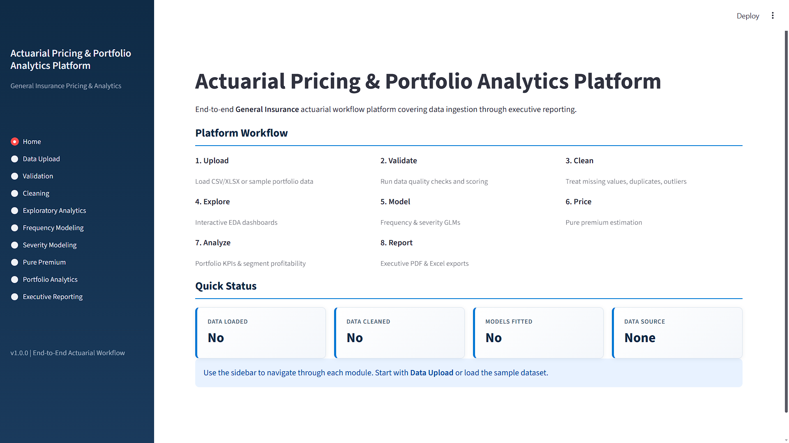
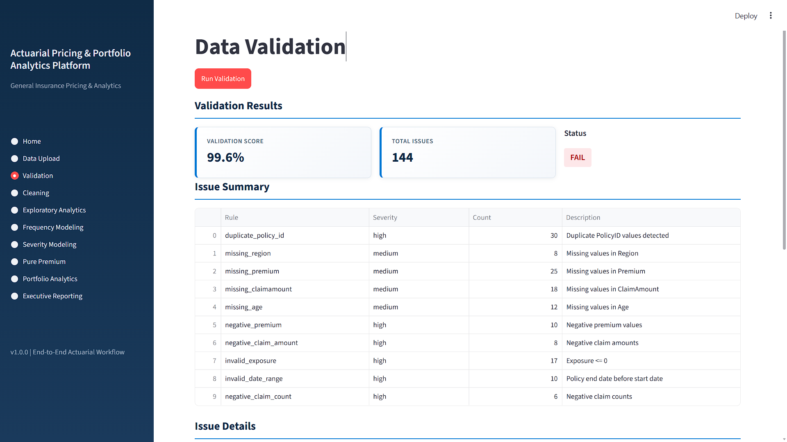
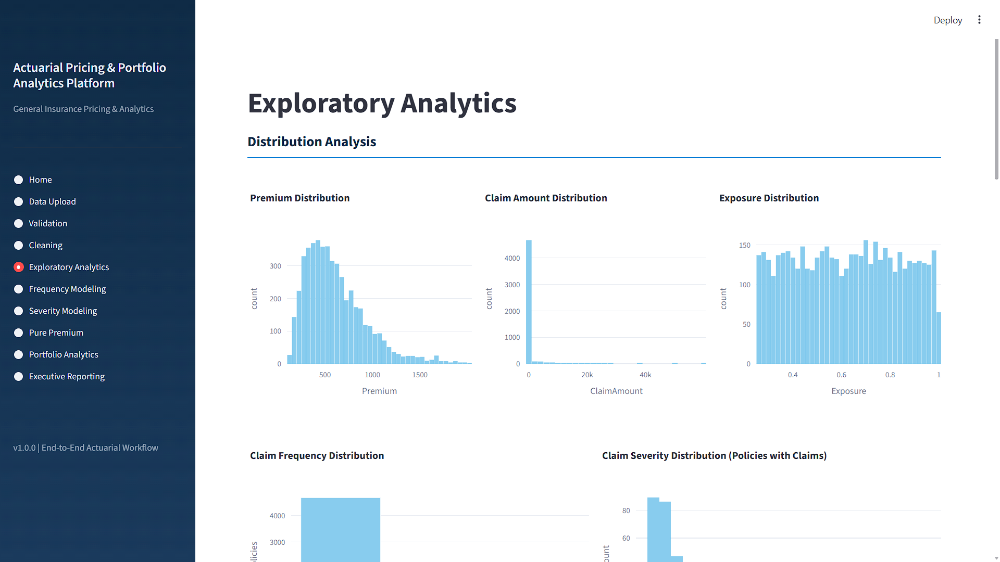
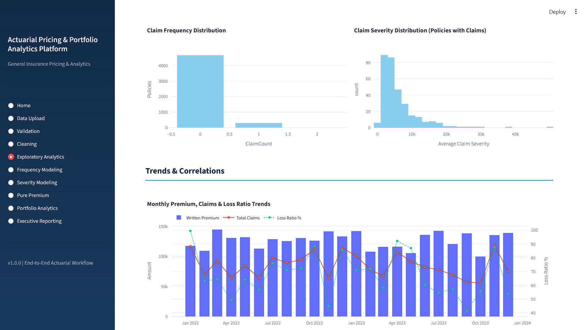
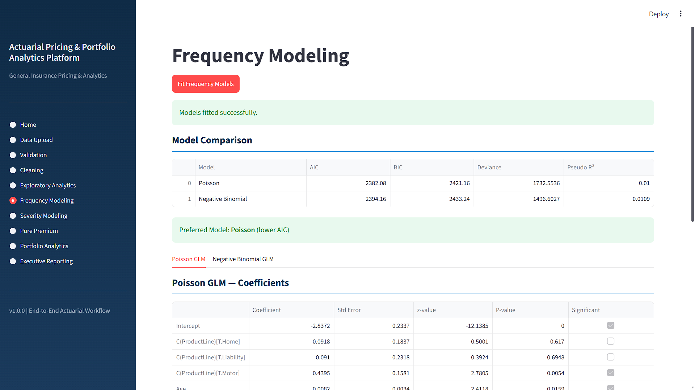
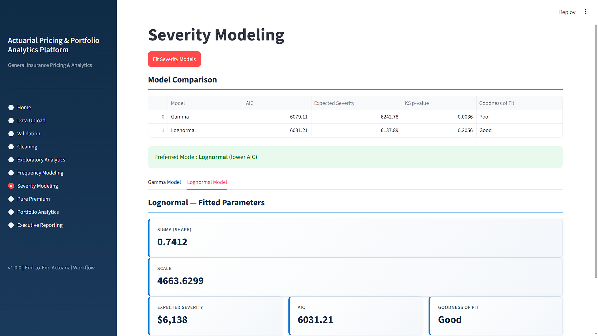
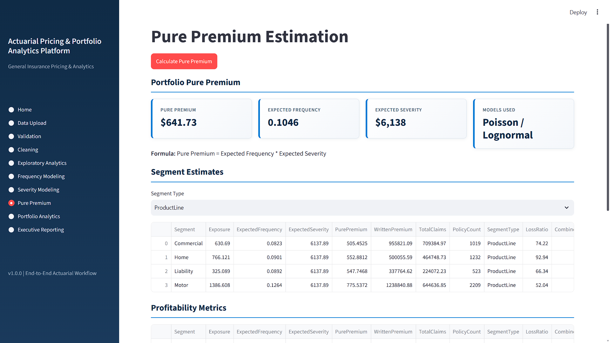
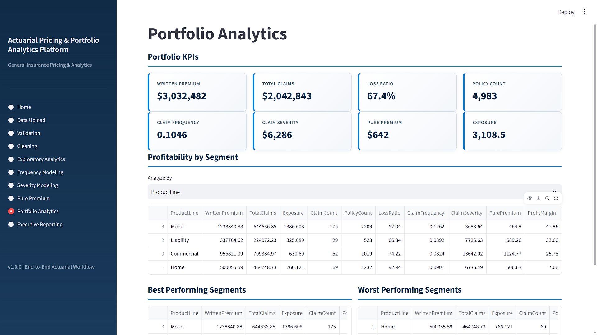
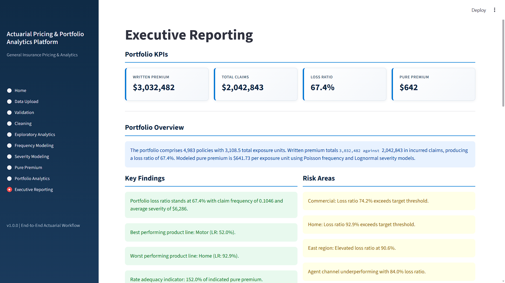
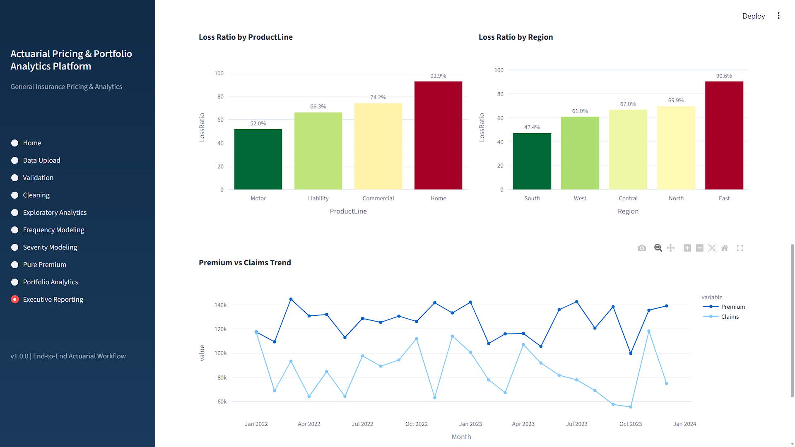

# Actuarial Analytics Platform

[](https://actuarial-analytics-platform-cntcazjrwtsnzyhphch5vt.streamlit.app/)
---

An end-to-end General Insurance Pricing & Portfolio Analytics platform built using Python, Streamlit, Plotly and Statistical Modeling.

The application simulates a real actuarial pricing workflow from raw portfolio ingestion through validation, cleaning, exploratory analytics, frequency modeling, severity modeling, pure premium estimation and executive reporting.

---

## Key Features

### Data Quality Engine

- Automated validation rules
- Missing value checks
- Range validation
- Business rule validation
- Data quality scoring

### Data Cleaning

- Missing value treatment
- Duplicate handling
- Outlier treatment
- Standardized actuarial dataset generation

### Exploratory Analytics

- Portfolio distributions
- Claim frequency analysis
- Severity analysis
- Correlation heatmaps
- Segment profitability analysis
- Trend visualizations

### Frequency Modeling

- Poisson GLM
- Negative Binomial GLM
- Model comparison
- AIC/BIC diagnostics
- Exposure offsets

### Severity Modeling

- Gamma GLM
- Lognormal Model
- Severity diagnostics
- Model comparison

### Pure Premium Pricing

- Frequency × Severity framework
- Segment level pricing
- Portfolio indication

### Portfolio Analytics

- Loss Ratio
- Claim Frequency
- Claim Severity
- Pure Premium
- Segment profitability analysis

### Executive Reporting

- Automated portfolio insights
- Risk identification
- Recommendations engine
- PDF & Excel export

---

## Architecture

```
Raw Data
    ↓
Validation
    ↓
Cleaning
    ↓
EDA
    ↓
Frequency Model
    ↓
Severity Model
    ↓
Pure Premium
    ↓
Portfolio Analytics
    ↓
Executive Reporting
```

---

## Application Screenshots

### Home Dashboard



---

### Data Validation



---

### Exploratory Analytics






---

### Frequency Modeling



---

### Severity Modeling



---

### Pure Premium Estimation



---

### Portfolio Analytics



---

### Executive Reporting





---

## Tech Stack

- Python
- Pandas
- NumPy
- Plotly
- Statsmodels
- OpenPyXL
- FPDF
- Streamlit

---

## Installation

```bash
git clone https://github.com/ashutoshraghavv/Actuarial-Analytics-Platform.git

cd Actuarial-Analytics-Platform

pip install -r requirements.txt

streamlit run app.py
```

---

## Project Structure

```text
src/
├── analytics/
├── cleaning/
├── data/
├── eda/
├── modeling/
├── pricing/
├── reporting/
├── ui/
├── utils/
└── validation/
```

---

## Future Enhancements (v2)

- Interactive dashboard exports
- Improved executive reporting
- Reserving module
- Exposure rating models
- Catastrophe analytics
- Machine learning pricing models
- Production deployment

---

## Author

Ashutosh Raghav

Student Actuary | Economics Undergraduate

Interested in Actuarial Analytics, Statistics, Risk Modelling, Finance, and Data Science.

---

